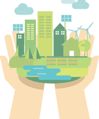

# ProjetoAS

Membros:

- Gabriel Cavalcanti Leandro de Lima
- Maria das Graças Soares da Costa
- Hiago Willyam Araújo Lacerda
- Sonaly Katly Garcia Nunes
- Roberta Felix da Silva

# Introdução

A preocupação com água potável, está relacionada ao fato, que a água está no centro do desenvolvimento sustentável e das suas três dimensões - ambiental, econômica e social. 
Por isso, garantir o seu acesso universal faz parte dos objetivos do Desenvolvimento Social das Nações Unidas.

E como mencionado pela Agenda 2030 da Organização das Nações Unidas (ONU) “os recursos hídricos, bem como os serviços a eles associados, sustentam os esforços de erradicação da pobreza, de crescimento econômico e da sustentabilidade ambiental. O acesso à água e ao saneamento importa para todos os aspectos da dignidade humana: da segurança alimentar e energética à saúde humana e ambiental”.
Á vista disso, o nosso projeto é focado no consumo susténtavel da água.

  

# Fluário

O Fluário é um sistema de inteligência artificial que tem por objetivo, auxiliar os usuários a terem um consumo de água mais sustentável. 

Com ele, o usuário poderá quantificar o gasto de água utilizado mensalmente e qual a quantidade de água necessária para realizar as atividades do contidiano. Ademais, poderá direcionar as águas utilizadas para sistemas de reuso, que irão ser encaminhadas à sistemas de irrigação familiar.

  

